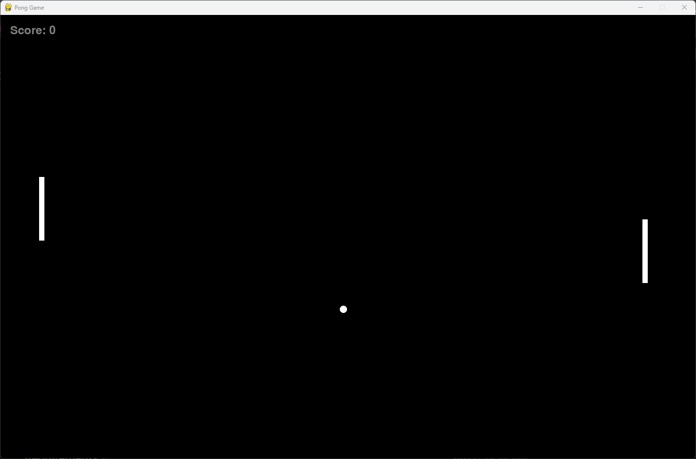
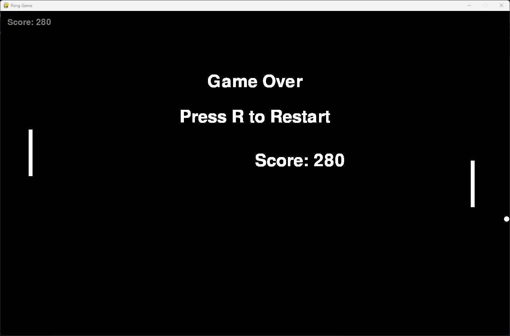

# Pong Game in Python
This is a simple pong game made using python and copilot.
## How to play
- Use `w` and `s` to move the left paddle up and down.
- Use `up` and `down` arrow keys to move the right paddle up and down.
- press `r` to restart the game when the restart message appears.
## How to run
- Clone the repository.
- Run `python3 main.py` in the terminal.
## Requirements
- Python 3
## Screenshots

